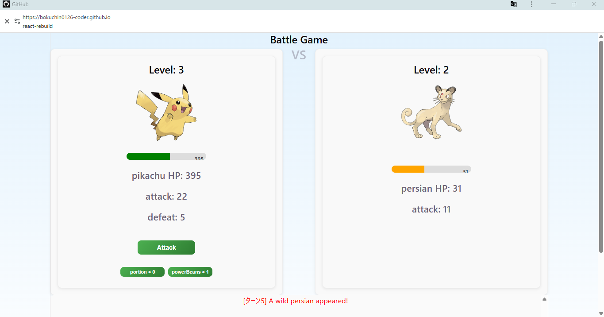

# Pokemon Battle Game
Reactで作成したターン制バトルゲームです。
プレイヤーのHPが0になるか、敵を30体撃破するまで戦います。

---

## Play Game
https://bokuchin0126-coder.github.io/react-battle-rebuild/

---

## Demo

---

## Features
-ターン制バトルシステム
-ランダムポケモン生成(PokeAPI)
-レベルアップシステム
-ボス戦(10 / 20 / 30体目で出現)
-アイテム(回復ポーション / パワービーンズ)
-HPバー・ダメージアニメーション
-ターンごとのログ表示

---

## Tech Stack
-React
-JavaScript
-CSS
-PokeAPI

---

## What I focused on
-コンポーネント分割(Player / Enemy)
-カスタムフック(useBattle)によるロジック分離
-状態管理によるターン制の実装
-ログのターン整理とUI改善

---

## Future Improvements
-ログの視認性向上
-ゲームバランスの調整
